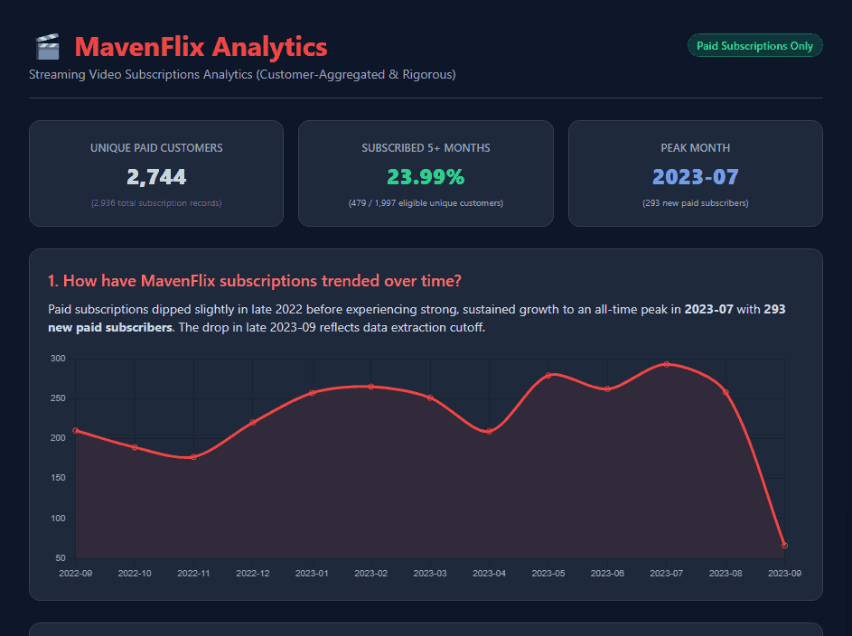
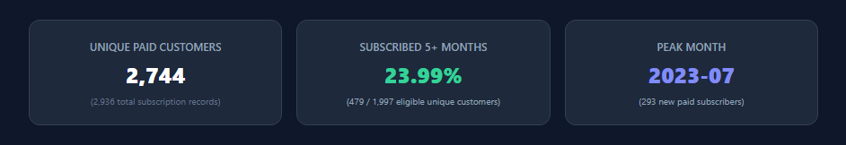
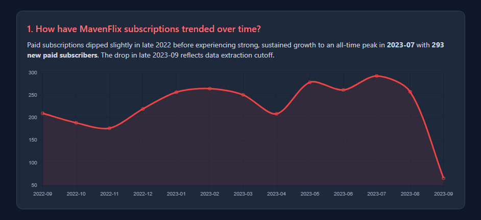
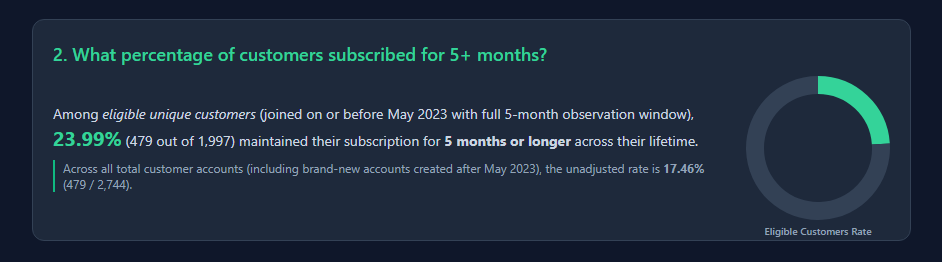
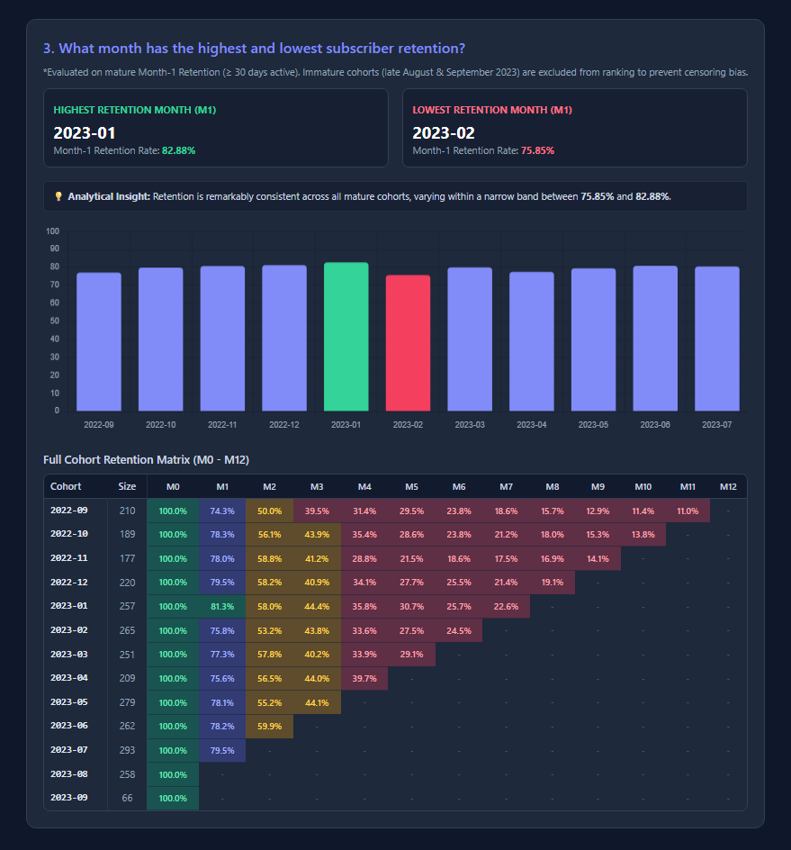

# 🎬 MavenFlix - Subscription Cohort & Retention Analytics


[](https://aly-hossam.github.io/saas-cohort-retention-dashboard/)

An end-to-end Python data pipeline and interactive analytics dashboard for **MavenFlix**, a fictitious video streaming platform. This project handles automated data extraction, exploratory data profiling, rigorous data cleaning (fixing right-censoring bias), and generates a mobile-optimized **HTML Dashboard** featuring dynamic Chart.js visualizations and a full **Cohort Retention Heatmap Matrix ($M_0 - M_{12}$)**.

---

### 🖥️ Interactive Dashboard Preview



---

## 📊 Executive Summary & Key KPIs

The dataset provides subscription records for MavenFlix subscribers over a 13-month period (**September 2022 through September 2023**).



The primary commercial objectives evaluated include:
1. Subscription acquisition growth trends over time.
2. Long-term customer retention ($5+$ months lifetime active).
3. Cohort-level retention rates ($M_0 - M_{12}$) while eliminating data maturity and right-censoring biases.

---

## 🎯 Key Business Questions Answered

### 1. How have MavenFlix subscriptions trended over time?
- **Finding:** Subscriptions experienced minor fluctuation in late 2022 before undergoing steady, rapid expansion, reaching an all-time peak in **July 2023** with **293 new paid subscribers**. 
- **Extraction Cutoff Note:** The drop in late September 2023 reflects data extraction cutoff rather than natural churn.



---

### 2. What percentage of customers subscribed for 5+ months?
- **Eligible Cohort Rate:** **23.99%** ($479$ out of $1,997$ eligible unique customers who joined on or before May 2023 and had a full 5-month observation window).
- **Unadjusted Rate:** Across all total customer accounts (including brand-new accounts created after May 2023), the unadjusted rate is **17.46%** ($479 / 2,744$).
- **Customer Aggregation:** Calculations group reactivated/re-subscribed users under unique `customer_id`s to measure true lifetime customer value.



---

### 3. What month has the highest and lowest subscriber retention?
- **Evaluation Criteria:** Evaluated using **Month-1 Retention ($M_1 \ge 30\text{ days active}$)** on mature cohorts. Immature cohorts (late August & September 2023) were excluded to prevent right-censoring bias.
- **Highest Retention Month ($M_1$):** **`2023-01` (82.88%)**
- **Lowest Retention Month ($M_1$):** **`2023-02` (75.85%)**
- **Key Takeaway:** Retention is highly consistent across all mature cohorts, fluctuating within a narrow, healthy band between **75.85% and 82.88%**.



---

## 🛠️ Project Pipeline & Architecture

The analytical workflow is automated through three modular Python scripts:

1. **`unzip_files.py`**: Scans the directory for `.zip` and `.tar` archives, extracts data to `extracted_files/`, and automatically strips macOS metadata (`__MACOSX`).
2. **`inspect_data.py`**: Runs an automated Exploratory Data Analysis (EDA) on all tabular files and generates a comprehensive Markdown inspection report (`data_overview_report.md`).
3. **`generate_html_report.py`**: Executes data transformations, filters unpaid transactions, resolves censoring bias, aggregates customer IDs, and compiles a standalone, mobile-friendly HTML report (`mavenflix_report.html`).

---

## 🔍 Methodology & Analytical Corrections

To deliver executive-ready analytics, several key data quality and logical adjustments were made:

- **Filter Unpaid Subscriptions:** Filtered out failed/unpaid subscription attempts (`was_subscription_paid == 'Yes'`), reducing raw records from $3,069$ to $2,936$ active paid records.
- **Customer-Level Lifetime Aggregation:** Grouped transactions by unique `customer_id` ($2,877$ unique customers) to accurately sum lifetime days for reactivated subscribers.
- **Right-Censoring Bias Correction:** Immature cohorts (subscribers created near the dataset max date of Sept 30, 2023) were excluded from Month-1 min/max retention rankings to avoid artificially low retention figures.
- **Full Cohort Retention Matrix ($M_0 - M_{12}$):** Integrated an interactive HTML/Tailwind Heatmap Matrix tracking retention rates across months.

---

## 📂 Repository Structure

```text
.
├── assets/                                    # Dashboard screenshots and GIF demos
│   ├── dashboard-demo.gif
│   ├── 00-kpis.png
│   ├── 01-subscriptions-trend.png
│   ├── 02-customer-retention-5months.png
│   └── 03-cohort-retention-heatmap-matrix.png
├── extracted_files/
│   ├── Subscription Cohort Analysis Data Dictionary.csv
│   └── Subscription Cohort Analysis Data.csv
├── unzip_files.py                             # Archive extractor & cleaner
├── inspect_data.py                            # Automated EDA & profiling script
├── generate_html_report.py                    # Main pipeline & HTML dashboard builder
├── data_overview_report.md                    # Auto-generated Markdown EDA report
├── mavenflix_report.html                      # Interactive mobile-friendly dashboard
└── README.md                                  # Project documentation
```

---

## ⚡ Installation & How to Run

### Prerequisites
- Python 3.8+
- `pandas` library

Install dependencies:
```bash
pip install pandas
```

### Execution Steps

1. **Extract Archives:**
   ```bash
   python3 unzip_files.py
   ```

2. **Generate EDA Profiling Report:**
   ```bash
   python3 inspect_data.py
   ```

3. **Build the Interactive HTML Dashboard:**
   ```bash
   python3 generate_html_report.py
   ```

4. **View Results:**
   Open `mavenflix_report.html` in any desktop or mobile browser.

---

## 📜 License & Credits

- **Dataset Source:** [Maven Analytics](https://mavenanalytics.io/) (Public Domain License).
- **Dashboard Tech Stack:** Python, Pandas, Tailwind CSS, Chart.js.
